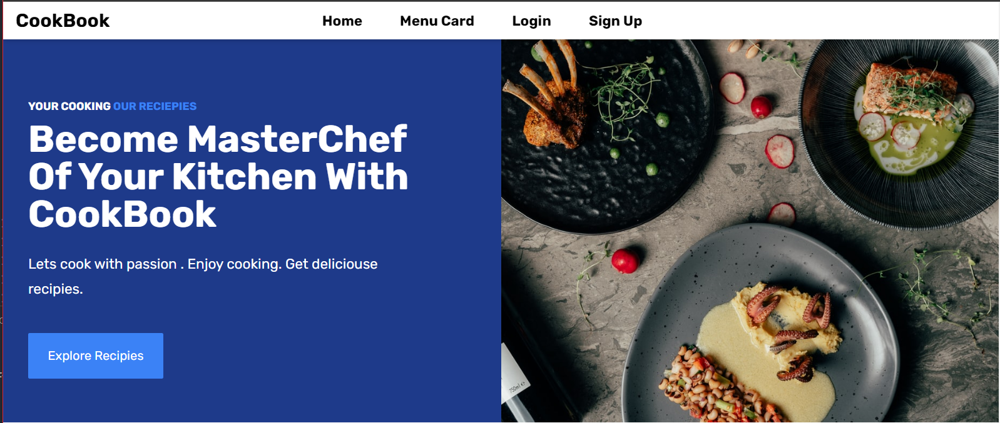

# CookBook
## A WebBased Cooking Receipe Library / Catlog

CookBook is a cloud-enabled, CI/CD Integrated and higly scalable
 Cook Reciepe Web App Build with Python [ flask ] And html , css and js 
- Read Reciepies from community
- Share your reciepies to community
- ✨ And Enjoy your cooking ✨

## Features

- User Registration And Authentication 
- Reciepie Add , Update And Delete
- Explore Page 
- User Reciepi Management
- Add new reciepi 
- Search Reciepies
## Tech
CookBook Uses Some of opensource techs to manage it

- Python - Intrean And Reach Featured Programming Language
- Flask - Python based framework to create webapps and apis
- Sqlalchemy - Sql client for connecting with databse

### Some of techs in infrastructure
CookBook uses CI/CD Pipeline with integrating Technologis like
- Github -  To Manage Source Code 
- Jenkins - To Create and manage CI/CD pipeline
- Docker (Docker Swarm) - To manage deployment on multiple node integrations
- Docker Hub - To manage docker built images
## Installation


Clone the repository

CookBook uses python-3.8 . Make sure you have it.
```sh
git clone https://github.com/Abdulzamad/flaskwebapp
```

### For Normal Usage
Create virtual envirnment and Activate it 
```sh
cd flaskwebapp
python -m venv .venv
source .venv/bin/activate
```
Install the dependencies .
```sh
pip install -r requirements.txt
```
Test Your Installation
```
pytest -v
```

### Build  With docker-compose

```sh
cd flaskwebapp
docker-compose up
```

Verify the deployment by navigating to your server address in
your preferred browser.

```sh
127.0.0.1:5000
```
## Deployment

You can easily deploy it with docker swarm and jenkins

- Create you swarm manager
- Join your swarm network from all worker nodes
- Now come back to Jenkins dashboard 
- Create a new task in jenkins and add new task 
- Use ```jenkinsfile``` as a jenkin pipeline script.
- Save 
- Run Build 
## License
The unit tests had to be edited several times to perfect it with an overall success once all the debugging issues were complete.


And future improvements I would do is;

Adds some more detail and objects that help make creating the recipes more interactive and fun. 


MIT

**Made easy right?!**
